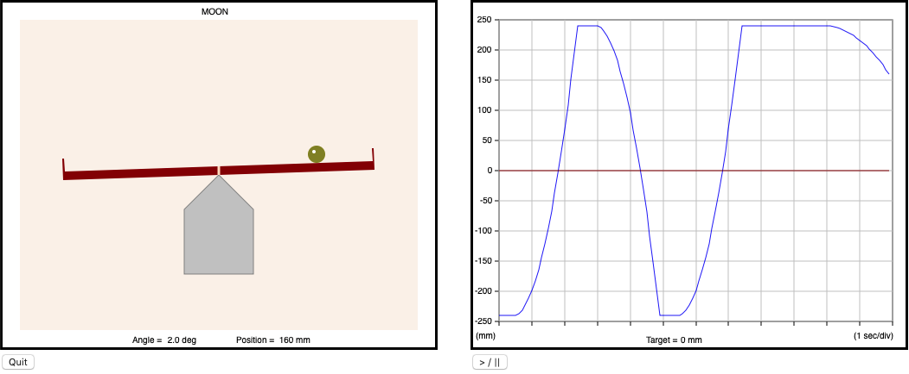
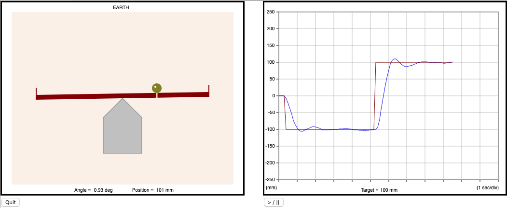

# BB
# A ball-on-beam system simulator

## General description
This project implements a simulator library for a ball on beam system. The aim is to serve as a virtual platform for teaching or just experimenting control systems programmed in Ada. The main motivation for writing this library is academic: the covid-19 pandemic has made it impossible for my students to attend the Real-Time Systems lab physically, so we have not had access to the hardware devices we use in the course. This simulator has made it possible to develop new contents for the course that all students have been able to work on from their homes, with no need for specific hardware. Although a simulator will never be like working with the real hardware, an effort has been made to reproduce real-life phenomenon, such as ADC measurement noise that you need to filter for more precise and smoother control.

The simulated system is formed by:

 - A 480 mm beam, whose inclination angle can be set between -15 deg and 15 deg. At angle 0 deg, the beam is horizontal.
 - A ball that moves along the beam, subject to the acceleration of gravity depending on the beam inclination.
 
The system presents a single input to it (the beam angle) and gives a single output (the ball position). There are two versions of the simulator that can be used, depending on the I/O interface they provide.

The simulator is essentially passive: it does not make simulation steps by itself

## Simulator structure
The simulator is implemented as a hierarchical library:

 * The root package, BB, provides the common types and operations to both interfaces (see below). 
 * Package BB.Ideal provides an ideal model of the system, where the position returned by the interface is exact and changes to the beam inclination have immediate effect, with no delay.
 * Package BB.ADC keeps the ideal interface to set the beam angle, but it models a 12-bit A/D converter (ADC) connected to an analog sensor to dertermine the ball position. The simulated ADC accepts polling or interrupt-like synchronisation, and it also simulates real-life gaussian noise -- which gives room for experimenting with filters.
 
This hierarchy is complemented with a GUI, common to both interfaces, implemented by package BB.GUI (and child packages BB.GUI.View and BB.GUI.Controller). The GUI is based on the [gnoga](https://github.com/alire-project/gnoga) library. It uses an internet browser to display a graphical animation of the simulated system and a real-time plot of the ball position, side by side. For control applications, the GUI can also be instructed to plot the target position on the plot graph. The GUI presents a "play/pause" button to freeze or resume the position plot (the animation always goes on); and a "quit" button, to close the connection with the application and let it terminate. The GUI connects with URL http://127.0.0.1:8080.

The system can be simulated on one of a selection of solar system objects, to try different gravities. Package BB offers the needed interface for this purpose (type Solar_System_Object and procedure Move_BB_To).

By default, the simulator is passive: it does not make simulation steps by itself. The ball position is only re-calculated when (i) the beam angle is set or (ii) the ball position is read. As a consequence, an open-loop application (e.g. Fee\_Fall in the example below) will not change the simulator state and the GUI will fail to show the ball position changing. This is not a problem with closed-loop applications, because they set the angle and read the position frequently; but for open-loop uses, package BB gives support for changing this default and setting the simulator operating mode to Open_Loop, in which the simulator automatically re-calculates simulation steps at 10 Hz (coinciding with the refresh period of the GUI animation).  

The images below are screenshots of the simulator GUI while running an open-loop and a closed-loop program. The first one corresponds to the execution of the open-loop application Free\_Fall (see code below, in Sec. *A simple example*).



The second screenshot was taken during the execution of a proportional-derivative control loop. The image shows the controller reaction to a 200 mm step in the setpoint. Note the marker drawn on the beam, reflecting the current setpoint.



## GNAT Runtime and the ADC interface
Package BB.ADC has runtime requirements that are not met by default in the GNAT runtimes where this project has been tested. In particular, BB.ADC uses timing events (TEs) with expiration times as short as 2 ms. In the native GNAT CE 2019 distributions for Linux, Windows and macOS, the default TE granularity is 100 ms. Using these runtimes with no mofication, the effective conversion delay of the ADC would be slightly above 100 ms, which imposes too large control periods.

There is a way around this problem: move the system to a low-gravity solar system object, where the control period can be larger (e.g. 250 ms) and the 100 ms conversion delay would be acceptable. However, if you want ADC conversions at the intended speed of 2 ms, you need to modify the GNAT CE runtime. In such case, you can follow the steps given below to modify the native Linux or macOS rutimes of GNAT CE 2019.

In the following:

  - *\<GNAT_DIR\>* is your GNAT CE 2019 installation folder (i.e., where the bin/ folder is located, containing gnatmake, gcc, etc.)
  - *\<RTS_DIR\>* depends on your platform:
  
    - On Linux: ```*lib/gcc/x86_64-pc-linux-gnu/8.3.1/rts-native/*```
    
    - On macOS: ```*lib/gcc/x86_64-apple-darwin17.7.0/8.3.1/rts-native/*```
    
  - **Step 0.**
  Depending on your permissions on the GNAT installation folders, you may need to "sudo su" (or get the needed permissions) before you take the following steps.

  - **Step 1.**
  Open the source file *<GNAT_DIR>/<RTS_DIR>/adainclude/a-rttiev.adb* in a text editor. Find the declaration of constant Period in line 101 of that file and change it to:
  
  ```Ada
  Period : constant Time_Span := Milliseconds (1);
  ```
  
  Then save and close the file.
    
  - **Step 2.**
  Make sure your PATH variable is conveniently prepended with *\<GNAT_DIR\>/bin*.

  - **Step 3.**
  Change to the appropriate folder and recompile the runtime:

   ```bash
    cd <GNAT_DIR>/<RTS_DIR>/adalib
    make -f Makefile.adalib ROOT=<GNAT_DIR>
   ```
You should now be able to use the modified runtime.
Note that this procedure modifies your Ada runtime. If you want to preserve it, you can apply these steps to a duplicate of your runtime. However, note that the change to the source code proposed here is minimal and reversible.  

##  Dependencies
The GUI packages depend on the [gnoga](https://github.com/alire-project/gnoga) library. There are no other dependencies. Note that you can also use the simulator without the GUI, in which case it has no dependencies at all.
 
 
## A simple example
The following example program moves the BB system to all objects defined by the enumeration type Solar_System_Object. On each object, it alternates the beam angle four times between 2 deg and -2 deg, once every 2.5 s, letting the ball fall freely during that time. A two-second pause is introduced before moving to the next solar system object. The program uses the Ideal interface and the GUI.

```Ada
    with BB, BB.Ideal, BB.GUI;
    use  BB, BB.Ideal, BB.GUI;

    procedure Free_Fall is
 
    begin

       Set_Simulation_Mode (Open_Loop);

       for Location in Solar_System_Object loop

          Move_BB_To (Location);

          for I in 1 .. 2 loop

             Set_Beam_Angle (2.0);
             delay 2.5;

             Set_Beam_Angle (-2.0);
             delay 2.5;

          end loop;

          delay 2.0;

       end loop;

    end Free_Fall;
```

## Is there a user manual?
There is no user manual as such at the moment. Information on how to use the library is provided however in multiple code comments. In particular, spec files  contain detailed descriptions. The aim is that these comments are sufficient to understand how to work with the library, but you are welcome to contact me if they are not for you...

##  Contact
Feel free to contact me by email (jorge@disca.upv.es) if you need help with this library, or you want to drop a comment or suggestion.
