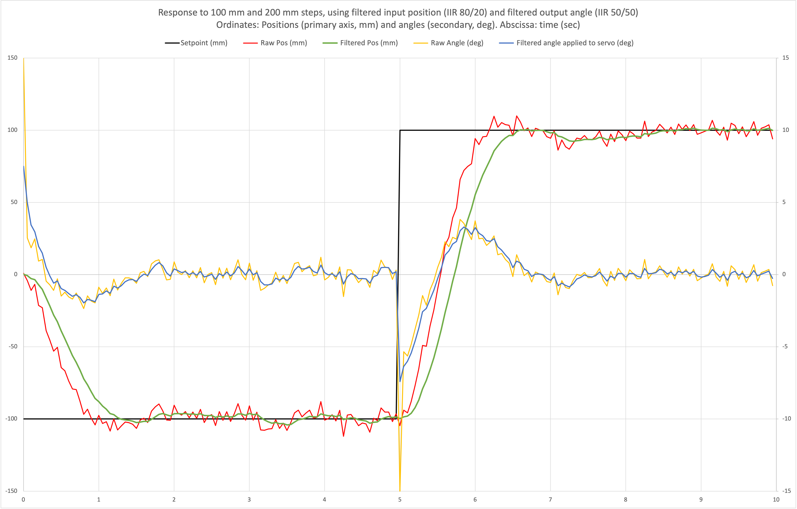

# BB: a ball-on-beam system simulator

_Jorge Real. Universitat Politècnica de València, Spain._

_Last modified on 14 November, 2022._

## General description
This project implements a simulator of a ball on beam system. The aim is to serve as a virtual platform for teaching or just experimenting control systems programmed in Ada. The main motivation for writing this library is academic: the covid-19 pandemic has made it impossible for my students to attend the Real-Time Systems lab physically, so we have not had access to the hardware devices we use in the course. This simulator has made it possible to develop new contents for the course that all students have been able to work on from their homes, with no need for specific hardware. Although a simulator will never be like working with the real hardware, an effort has been made to reproduce real-life phenomenon, such as ADC measurement noise that you need to filter for more precise and smoother control.

The simulated system is formed by:

 - A 480 mm beam, whose inclination angle can be set between -15 deg and 15 deg. At angle 0 deg, the beam is horizontal.
 - A ball that moves along the beam, subject to the acceleration of gravity depending on the beam inclination.
 
The system presents a single input to it (the beam angle) and gives a single output (the ball position). 

## Simulator structure
The simulator is implemented as a hierarchical library:

 * The root package, ```BB```, provides the common types and operations to both interfaces (see next). 
 * Package ```BB.Ideal``` provides an ideal model of the system, where the position returned by the interface is exact and changes to the beam inclination have immediate effect, with no delay.
 * Package ```BB.ADC``` keeps the ideal interface to set the beam angle, but it emulates a 12-bit A/D converter (ADC) connected to an analog sensor to dertermine the ball position. The simulated ADC accepts polling or interrupt synchronisation and it also simulates real-life gaussian noise -- which gives plenty of room for experimenting with filters.
 
This hierarchy is complemented with a GUI, common to both interfaces, implemented by package ```BB.GUI``` and its child packages ```BB.GUI.View``` and ```BB.GUI.Controller```. The GUI is based on the [Gnoga](https://github.com/alire-project/gnoga) library. It uses a web browser to display a graphical animation of the simulated system and a real-time plot of the ball position, side by side. For control applications, the GUI can also be instructed to plot the target position on the graph. The GUI presents a "play/pause" button to freeze or resume the position plot (the animation always goes on); and a "quit" button, to close the connection with the application and let it terminate. 

The system can be simulated on one of a selection of solar system objects, to experiment with different gravities. Package BB offers the needed interface for this purpose (type Solar_System_Object and procedure Move_BB_To).

By default, the simulator is passive: it does not make simulation steps by itself; instead, the ball position is only re-calculated (i) when the beam angle is set, or (ii) when the ball position is read. This is fine for control applications because they need to set the beam angle and read the ball position frequently enough and the GUI can show progress. For open loop applications, the operating mode must be set to Open_Loop, so that the simulator becomes active and calculates simulation steps at 10 Hz (coinciding with the refresh period of the GUI animation).

The images below are screenshots of the simulator GUI while running an open-loop and a closed-loop program. The first one corresponds to the execution of the open-loop application Free\_Fall (see code below, in Section *A simple example*).


The second screenshot was taken during the execution of a proportional-derivative control loop. The image shows the controller reaction to a 200 mm step in the setpoint. Note the yellow marker drawn on the beam, which indicates the current setpoint.


## GNAT Runtime and the ADC interface
Package ```BB.ADC``` has runtime requirements that are not met by default in the GNAT runtimes where this project has been tested. In particular, it uses timing events (TEs) with expiration times as short as 2 ms. In current GNAT distributions for Linux, Windows and macOS, the default TE granularity is 100 ms. Using these runtimes with no modification, the effective conversion delay of the ADC would be slightly above 100 ms, which imposes too large control periods.

A way around this problem is to move the system to a low-gravity solar system object, where the control period can be larger (e.g. 250 ms) and the 100 ms conversion delay would be acceptable. 

However, if you want ADC conversions at the intended delay of 2 ms, you need to modify the GNAT runtime. The modification consists in changing the declaration of constant ```Period``` in file *a-rttiev.adb* to make it:

  ```Ada
  Period : constant Time_Span := Milliseconds (1);
  ```
How to recompile your runtime depends on the toolchain and version you are using. There are project files for that in the GNAT Community Edition versions.  For FSF distributions, see the [GCC installation instructions](https://gcc.gnu.org/install).
  
##  Dependencies
The GUI packages depend on the [Gnoga](https://github.com/alire-project/gnoga) library version 2. As of today, the latest Gnoga version used by ```BB``` is 2.1a. There are no other dependencies. Note that you can also use the simulator without the GUI, in which case it has no dependencies at all. 

The project file ```ball_on_beam_simulator.gpr``` refers to the Gnoga project file in a particular location. You need to replace that location with the location of Gnoga in your case. Alternatively, you can _install_ Gnoga and just use ```with "gnoga"``` at the start of the project file. See section _Installing Gnoga_ in the Gnoga User's Guide. 

Indeed, if you decided **not** to use the simulator GUI at all, you can just delete the ```with``` clause in ```ball_on_beam_simulator.gpr``` and remove the six source files of the ```BB.GUI```hierarchy: ```bb-gui*.*```. 

##  Data logging utility
Even if you don't use the GUI, you can make *a posteriori* data analysis. Package CSV\_Logs, in folder```utils``` facilitates data logging to standard output or to a CSV file. The figure shows a plot obtained from a log file generated with this package. 

This control experiment in particular shows the response of a PD controller to an initial 100 mm step and then a 200 mm step at time 5 seconds. Since it uses the ADC interface to the ball and beam system, the raw position read from the ADC must be filtered to reduce noise. Some filtering is also applied to the output angle. The graph shows the raw and filtered position and angle values, as well as the setpoint. With CSV\_Logs, you log an unconstrained array of Floats with as many components as your experiment requires.
 


 
## A simple example
The following example program moves the BB system to all objects defined by the enumeration type Solar_System_Object. On each object, it alternates the beam angle four times between 2 deg and -2 deg, once every 2.5 s, letting the ball fall freely during that time. A two-second pause is introduced before moving to the next solar system object. The program uses the Ideal interface and the GUI.

```Ada
    with BB, BB.Ideal, BB.GUI;
    use  BB, BB.Ideal, BB.GUI;

    procedure Free_Fall is
 
    begin

       Set_Simulation_Mode (Open_Loop);

       for Location in Solar_System_Object loop

          Move_BB_To (Location);

          for I in 1 .. 2 loop

             Set_Beam_Angle (2.0);
             delay 2.5;

             Set_Beam_Angle (-2.0);
             delay 2.5;

          end loop;

          delay 2.0;

       end loop;

    end Free_Fall;
```

## Is there a user manual?
There is no user manual as such at the moment. Information on how to use the library is provided however in multiple code comments. In particular, spec files contain detailed descriptions on how to use ```BB```, ```BB.Ideal```, ```BB.ADC```, and ```BB.GUI```. 

##  Contact
Feel free to contact me by email (jorge@disca.upv.es) if you need help with this library, or if you want to drop a comment or suggestion.
